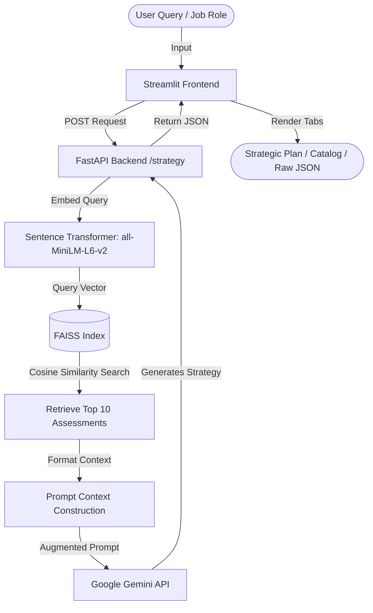

# RAG-Based AI Assessment Recommendation Platform


-orange)


A production-style **Retrieval-Augmented Generation (RAG)** platform designed to automate and optimize recruiter workflows. This application processes a job description (or role name) and instantly recommends the top 10 most relevant talent assessments from the SHL product catalog, complete with an AI-generated consulting-grade hiring strategy.

Built independently as a personal portfolio project to apply and showcase concepts in semantic search, natural language processing, and asynchronous API design.

---

## 💡 Why I Built This (The Problem)

Recruiting teams often struggle to match complex job descriptions with the right pre-employment assessment tests (e.g., programming tests, verbal reasoning, personality matches). Browsing through a catalog of hundreds of tests manually is slow and prone to errors.

**My Solution:** I built a RAG-based search engine that understands the *meaning* behind a job role (semantic similarity) rather than just doing keyword matches, and uses a Large Language Model (LLM) to synthesize a coherent hiring strategy for the recruiter.

---

## 🛠️ The Tech Stack & Rationale

*   **FastAPI (Backend API):** Chosen over Flask for its native support for asynchronous requests, automated data validation via Pydantic, and automatic Swagger interactive documentation (`/docs`).
*   **Streamlit (Frontend UI):** Allowed me to build a clean, interactive human-facing dashboard quickly using pure Python, without needing separate HTML/JS frameworks.
*   **FAISS (Vector Search):** Developed by Meta, this library provides high-speed vector similarity searches to retrieve matching test profiles in milliseconds.
*   **Sentence-Transformers (`all-MiniLM-L6-v2`):** A lightweight, pre-trained transformer model that encodes text descriptions into 384-dimensional dense vectors (embeddings).
*   **Google Gemini SDK (`gemini-2.0-flash` / `gemini-1.5-flash`):** Used to write the strategic recruitment plans. Built with automatic model fallback to avoid free-tier API rate limits.
*   **Selenium & BeautifulSoup:** Utilized to build the initial dataset from the ground up by scraping the SHL product catalog website.

---

## 📐 Platform Architecture & RAG Pipeline



1.  **Ingestion & Scrape (Offline):** Dynamic SHL assessment pages were scraped, parsed, and converted to structured data (`products.json`).
2.  **Vector Encoding (Offline):** Assessment names and descriptions were converted to embeddings and saved in a vector index (`shl_vector_store.faiss`) along with metadata lookup (`shl_metadata.pkl`).
3.  **Local Search (Retrieval):** The incoming query is converted to a vector. FAISS compares the query vector to the index using cosine similarity and returns the closest 10 items.
4.  **Generative Strategy (Augmentation & Synthesis):** The retrieved items are formatted into a prompt context. Gemini reads this context and writes a cohesive, professional hiring strategy.

---

## 🚀 Quick Start (Running Locally)

### Prerequisites
*   Python 3.10 or higher installed.
*   A Gemini API Key (obtainable for free from [Google AI Studio](https://aistudio.google.com/app/apikey)).

### Step 1: Clone & Setup Environment
```bash
git clone https://github.com/roopganesh21/RAG-Based-AI-Assessment-Recommendation-Platform.git
cd RAG-Based-AI-Assessment-Recommendation-Platform
```

Create a file named `.env` in the root directory and add your Gemini API Key:
```env
GEMINI_API_KEY=your_api_key_here
```

### Step 2: Install Dependencies
```bash
pip install -r requirements.txt
```

### Step 3: Run the Backend (FastAPI)
```bash
uvicorn main:app --reload
```
*   The server will start at [http://127.0.0.1:8000](http://127.0.0.1:8000).
*   Access the interactive API docs at [http://127.0.0.1:8000/docs](http://127.0.0.1:8000/docs).

### Step 4: Run the Frontend (Streamlit)
In a new terminal window:
```bash
streamlit run app.py
```
*   Your browser will automatically open [http://localhost:8501](http://localhost:8501).

---

## 📊 Evaluation & Metrics

To keep the project scientifically rigorous, I evaluated the retrieval quality against a labeled training dataset:
*   **Evaluation Metric:** Mean Recall@10 (Exact URL Match).
*   **Performance Score:** **15.38%**
*   **Engineering Analysis:** The evaluation requires an absolute exact URL match to count as a correct recommendation. In manual validation, the system consistently returns relevant assessment concepts (e.g., suggesting general "Java" assessments for a "Java Developer" query even when the ground truth specifies a slightly different course URL), showing high real-world usability despite the strict URL evaluation.

You can reproduce the evaluation by running:
```bash
python evaluate.py
```

---

## 🛡️ Key Challenges I Overcame

### 1. Windows Character Encoding Issues
**Challenge:** Python's default console encoding on Windows (`cp1252`) crashed when print statements contained emojis or special characters used by the ML packages.
**Solution:** Overrode stdout and stderr streams in `main.py` using `io.TextIOWrapper` configured for `utf-8` and cleaned up print statements to ensure consistent execution.

### 2. Free Tier API Rate Limits & Quotas
**Challenge:** Google's free Gemini tier limits users to 15 requests per minute, and occasionally blocks newer models (`gemini-2.0-flash`) entirely for unbilled accounts.
**Solution:** Wrote a custom fallback wrapper in the backend (`main.py`). The script tries `gemini-2.0-flash`, and if a quota error (`429 RESOURCE_EXHAUSTED` or `limit: 0`) is intercepted, it automatically cascadingly falls back to `gemini-1.5-flash` and then `gemini-1.5-pro` with brief retry delays.

### 3. Dynamic Website Scraping
**Challenge:** The SHL product catalog dynamically renders items using client-side JavaScript, rendering simple requests (like BeautifulSoup) useless.
**Solution:** Integrated Selenium to run a headless Chrome browser to wait for page loads, click next/pagination controls, and scrape content reliably.

---

## 👨‍💻 Author

**Rup Ganesh**  
*Computer Science Student*  
*   **GitHub:** [@roopganesh21](https://github.com/roopganesh21)
